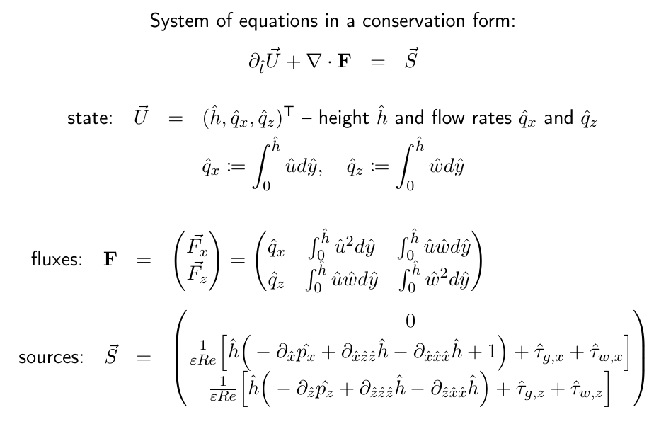
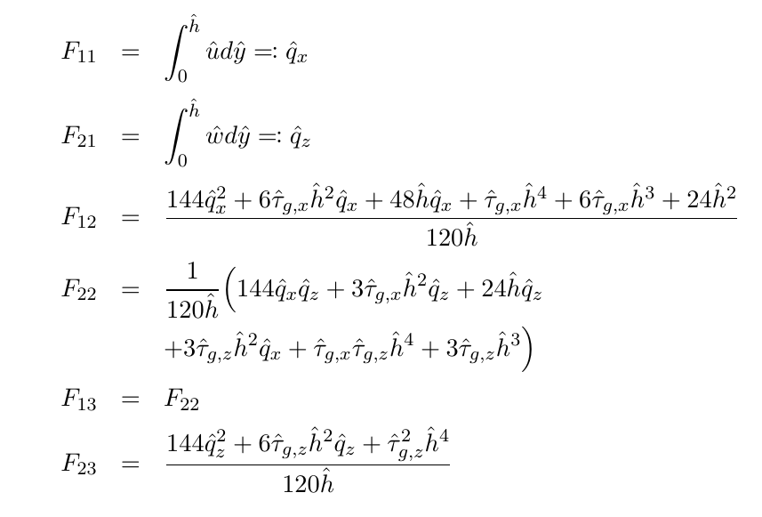
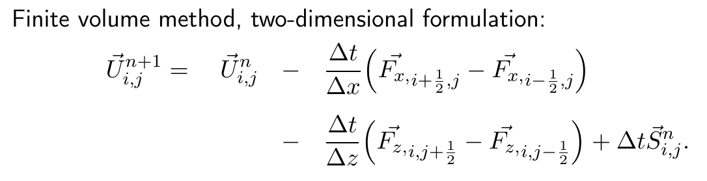
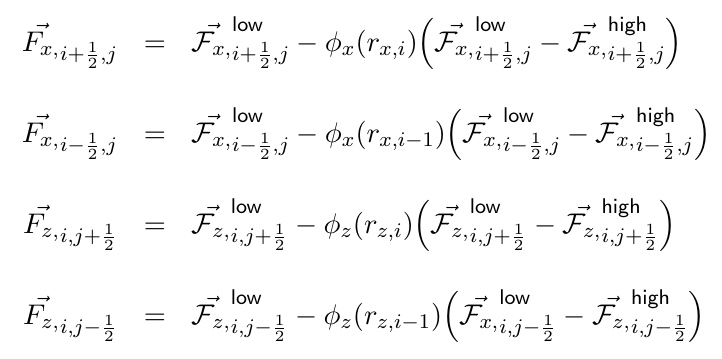
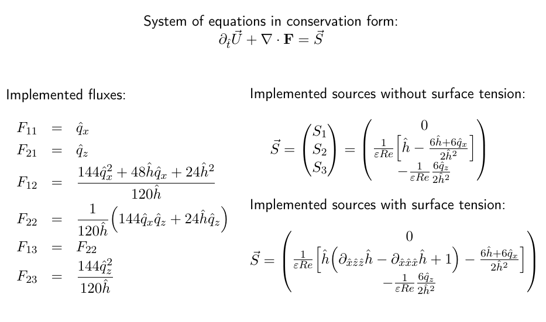

# liquid_film_solver
A solver for an integral boundary layer model for liquid films on moving substrates.

This project solves a simplified version of the 3D integral model
for a liquid film on a moving substrate.
The unknowns of this integral model are
the liquid film height h,
the flow rate along the streamwise direction qx,
and the flow rate along the spanwise direction qz
(check RM2021 report).

The 3D integral model is dimensionless.
It is derived during RM2021 using a common approach
in boundary layer theory.
The starting point is the Navier-Stokes equations
for a divergence-free Newtonian fluid.
Re-formulating the equations in their dimensionless version
using proper reference quantities
leads to the possibility to neglect terms of higher order
with respect to a liquid film parameter
defined as the ratio between the wall-normal scale
and the streamwise scale.
What is obtained is a dimensionless system
in a first-order long-wave approximation.
This approach allows to preserve the nonlinearities of the system.
The final step of the derivation of the 3D integral model is
the integration along the wall-normal direction.
This yields a system with three unknowns which depends only
on two spatial coordinates.
Therefore, a three-dimensional problem is converted
to a two-dimensional configuration.
This is an important advantage
because it reduces significantly the computational
costs of the liquid film simulations.

This system accounts for all physical forces and the equations are:

Flux matrix elements:

To discretise this system, the 2D formulation of the finite volume method is applied:

The numerical fluxes are approximated by a blended scheme:

What is currently not completely implemented
in this version of the solver are
pressure gradients (as they affect a narrow region of the domain),
interface shear stresses,
and the most challenging - surface tension terms
(the third derivatives of the height h).

This is the working simplified version of the 3D model that the solver currently can investigate:

